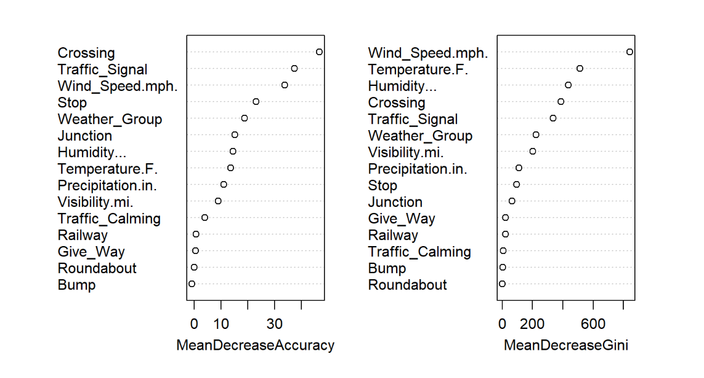

# US Car Accident Severity Analysis

## Key Finding

Traffic signals and crossings were associated with lower accident severity, while junctions and higher wind speeds were among the strongest predictors of severe crashes. A Random Forest model trained on U.S. accident data showed that roadway characteristics were more important than weather conditions for predicting accident severity.

---

This project analyzes U.S. traffic accidents using exploratory data analysis and machine learning to identify the factors most associated with severe crashes.

## Key Findings

- Roadway features such as crossings, traffic signals, and junctions were among the strongest predictors of accident severity.
- Weather variables like wind speed and visibility contributed to prediction, but roadway characteristics had a greater overall impact.
- A Random Forest model outperformed Logistic Regression, showing that nonlinear relationships improve accident severity prediction.

## Preview

### Severity Distribution


### Random Forest Variable Importance



## Project Overview

This project explores the US Accidents dataset to understand which environmental and roadway conditions are associated with severe traffic accidents.

The workflow includes:

- Exploratory data analysis
- Data cleaning and preprocessing
- Feature engineering
- Logistic Regression
- Random Forest classification
- Model evaluation using Accuracy, Precision, Recall, F1 Score, and AUC

## Technologies

- R
- Quarto
- tidyverse
- caret
- randomForest
- pROC
- ggplot2

## Dataset

The complete dataset is available on Kaggle:

https://www.kaggle.com/datasets/sobhanmoosavi/us-accidents

Only a sample of the dataset is included in this repository because the original dataset exceeds GitHub's file size limit.

## Repository Structure

```
.
├── R/
│   └── functions.R
├── data/
│   └── accidents_sample.csv
├── img/
│   ├── severity-distribution.png
│   └── feature-importance.png
├── analysis.qmd
├── index.html
└── README.md
```

## Running the Project

Clone the repository and open the project in RStudio.

Render the report with

```r
quarto::quarto_render("analysis.qmd")
```

## Results

The Random Forest model achieved better predictive performance than Logistic Regression, indicating that interactions between roadway characteristics and weather conditions are important for predicting accident severity.

## Author

Javier Zialcita

Statistics | Data Science
